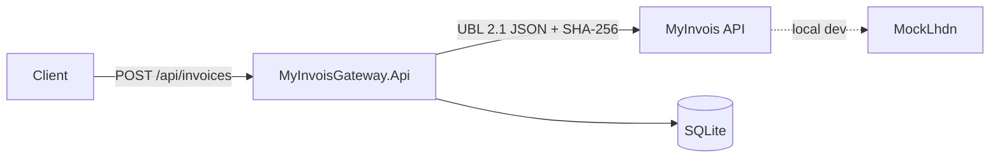

# MyInvois Gateway

[](https://github.com/shafiq97/lhdn/actions/workflows/ci.yml)
[](https://dotnet.microsoft.com/download/dotnet/8.0)
[](LICENSE)

## What is this

MyInvois Gateway is an integration service that sits in front of Malaysia's LHDN MyInvois e-Invoicing platform. It accepts a simple invoice JSON payload from a client system and handles the messy parts of talking to MyInvois for you: mapping to UBL 2.1 document JSON, OAuth2 client-credentials authentication, SHA-256 document hashing, idempotent submission, and retry/circuit-breaker resilience against a flaky upstream. It ships with a built-in mock LHDN server, so the full demo — API, database, and a stand-in for MyInvois — runs completely offline with `docker compose up`, no Malaysian TIN or real credentials required.

## Architecture



- **MyInvoisGateway.Api** — ASP.NET Core 8 controller-based service; the deliverable.
- **MockLhdn** — a minimal ASP.NET Core app imitating the parts of the MyInvois API surface the gateway calls (`connect/token`, `documentsubmissions`, status polling, cancel). Used for local dev and the offline demo; swap it out for the real sandbox via configuration only.
- **SQLite** — file-based storage for invoice records and idempotency records, via EF Core.

## Live demo

[](https://render.com/deploy?repo=https://github.com/shafiq97/lhdn)

A hosted demo runs on Render's free tier (API + mock LHDN as two services, defined in [`render.yaml`](render.yaml)):

- **Swagger UI:** `https://myinvois-gateway-api.onrender.com/swagger`

> Free-tier services sleep after 15 minutes idle — the first request can take ~50 seconds while the container cold-starts. The SQLite database is ephemeral and resets on redeploy, which keeps the demo self-cleaning.

Try it: open Swagger, `POST /api/invoices` with the sample payload from the Quickstart below, then poll `GET /api/invoices/{id}` to watch the status move to `Accepted`. Submitting a seller TIN ending in `9` demonstrates the rejection path.

## Quickstart

```bash
docker compose -f deploy/docker-compose.yml up --build
```

This starts the API on `:8080` and the mock LHDN server on `:8081`.

**Submit an invoice** (an `Idempotency-Key` header is required):

```bash
curl -s -X POST http://localhost:8080/api/invoices \
  -H "Content-Type: application/json" \
  -H "Idempotency-Key: demo-1" \
  -d '{
    "invoiceNumber":"INV-DEMO-1",
    "issueDateUtc":"2026-07-04T00:00:00Z",
    "currencyCode":"MYR",
    "sellerTin":"C1234567890",
    "sellerName":"Acme Sdn Bhd",
    "buyerTin":"C0987654321",
    "buyerName":"Beta Sdn Bhd",
    "lines":[{"description":"Widget","quantity":2,"unitPrice":50.00}]
  }'
```

Returns `201 Created` with the local record id, invoice status, and the LHDN `submissionUid`/`documentUid`. Repeating the exact same request with the same `Idempotency-Key` replays the original response as `200 OK` instead of submitting again; reusing the key with a different body returns `422`.

**Check status** (auto-refreshes from LHDN if the invoice is still `Submitted` and the last-known status is more than 30 seconds stale):

```bash
curl -s http://localhost:8080/api/invoices/{id}
```

**Cancel an invoice** (only valid while the invoice is `Valid`, within the cancellation window):

```bash
curl -s -X POST http://localhost:8080/api/invoices/{id}/cancel
```

Returns `409 Conflict` if the invoice isn't currently `Valid` (e.g. still `Submitted`, already `Cancelled`, or `Invalid`).

**Health check:**

```bash
curl -s http://localhost:8080/health
```

**Interactive API docs** are available at `http://localhost:8080/swagger`.

### Mock LHDN behavior worth knowing

The bundled mock approximates MyInvois closely enough to exercise the full lifecycle without a real sandbox:

- A seller TIN ending in `9` is deterministically flagged `Invalid` on the next status poll, so the failure path is exercisable on demand.
- Newly submitted documents sit in `Submitted`/`InProgress` for `Mock:ValidationDelaySeconds` (default 5s) before flipping to `Valid` or `Invalid` — this exercises the GET endpoint's polling/refresh behavior.
- The cancellation window is `Mock:CancelWindowMinutes` (default 5 minutes in the mock, versus the real MyInvois 72-hour window) so cancellation can be demoed without waiting days.

## Switching to the real LHDN sandbox

No code changes are required — only configuration. Point the gateway at LHDN's preprod environment and supply real credentials from the MyInvois portal:

```bash
Lhdn__BaseUrl=https://preprod-api.myinvois.hasil.gov.my
Lhdn__ClientId=<your real client id>
Lhdn__ClientSecret=<your real client secret>
```

Set these as environment variables (see `deploy/docker-compose.yml` or `deploy/k8s/api.yaml` for where they're wired in) or in `appsettings.json` under the `Lhdn` section. The `IMyInvoisClient` abstraction and `MockLhdn` project are otherwise irrelevant once pointed at a real base URL.

## Design highlights

**Idempotency semantics**

| Scenario | Behavior |
|---|---|
| Missing `Idempotency-Key` | `400 Bad Request` |
| New key | Submits normally, persists the key + request hash, returns `201` |
| Duplicate key, same request body | Returns the original response, `200 OK`, no re-submission to LHDN |
| Duplicate key, different request body | `422 Unprocessable Entity`, no submission |

**Invoice state machine**

`Submitted → Valid | Invalid`, and `Valid → Cancelled` (within the cancellation window). This mirrors the MyInvois document lifecycle: an invoice can only be cancelled while it is currently `Valid`; attempting to cancel from any other state returns `409`.

**Token caching with single-flight refresh** — `TokenService` performs the OAuth2 client-credentials flow against `connect/token`, caches the access token in memory, and proactively refreshes it 5 minutes before expiry. Concurrent callers needing a fresh token share a single in-flight refresh rather than each firing their own request.

**Resilience pipeline** — Retries with exponential backoff and a circuit breaker are provided by `Microsoft.Extensions.Http.Resilience`'s standard resilience handler defaults.

**Error handling**

| Failure | Behavior |
|---|---|
| LHDN 400/422 (validation) | Persist `Invalid` + error details; return `422` with the LHDN error array |
| LHDN 401 (token expired mid-flight) | Single forced token refresh + one retry, then fail |
| LHDN 5xx / timeout | Polly retry ×3 with backoff; then `502` + correlation id; invoice stays `Submitted` for later polling |
| Duplicate `Idempotency-Key`, same body | Return original response (`200`) |
| Duplicate `Idempotency-Key`, different body | `422`, no submission |
| Missing `Idempotency-Key` | `400` |

## Testing

```bash
dotnet test
```

31 tests, all in-process (no external services required):

- **Unit** — invoice state machine transitions, UBL 2.1 mapper (golden sample payload), OAuth2 token service (expiry, refresh, single-flight), typed HTTP client error mapping.
- **Integration** — full submit → poll → valid lifecycle, invalid-document path, cancel path (success + `409` conflict), idempotent resubmission (replay and conflict), all run via `WebApplicationFactory` against the in-process mock LHDN — no Docker or network access needed.

## Kubernetes

Manifests live in `deploy/k8s/`:

```bash
kubectl apply -f deploy/k8s/
```

This creates the `myinvois` namespace, a `ConfigMap` for non-secret configuration (`Lhdn__BaseUrl`), a `Secret` template (`lhdn-credentials`) holding `Lhdn__ClientId`/`Lhdn__ClientSecret`, plus `Deployment`/`Service` objects for both the API and MockLhdn. The API deployment includes readiness/liveness probes against `/health`. Replace the values in the `Secret` with real MyInvois credentials before pointing at production — never commit real secrets into the manifest.

## Roadmap

- **Digital signature** (document format v1.1) — v1 submits unsigned (v1.0-style) documents; the mock accepts them as-is. Real MyInvois production traffic requires an X.509 certificate issued to a registered taxpayer and document signing, which is out of scope for v1.
- **Credit/debit notes** (document types 02/03) — v1 only supports invoices (type 01).
- **Consolidated invoices.**
- **SQL Server provider** — v1 uses SQLite for demo portability; swapping providers via EF Core is a configuration/DI change, not a rewrite.
- **EF Core migrations** — v1 uses `EnsureCreated` for zero-setup demo simplicity; production use should switch to versioned migrations.

### Known v1 limitations

- **Concurrent requests with the same `Idempotency-Key`** can both reach LHDN before either idempotency record is persisted (no distributed lock or outbox pattern yet), risking a double submission under a race.
- **Crash after LHDN submission but before the local save completes** results in a duplicate submission if the client retries with the same key, since the gateway has no record of the first attempt.
- **Single-document submissions only** — no batch submission support.

## Disclaimer

This project is an independent, unofficial integration and is **not affiliated with, endorsed by, or officially connected to LHDN** (Lembaga Hasil Dalam Negeri Malaysia) or the MyInvois platform. `MockLhdn` is a best-effort approximation of the publicly documented MyInvois API surface, built for local development and demonstration purposes only — it is not a certified test environment and should not be used to validate production readiness against the real MyInvois system.
