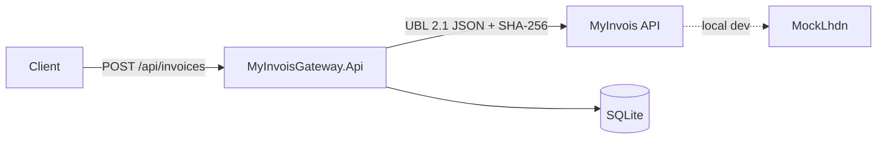

# MyInvois Gateway Implementation Plan

> **For agentic workers:** REQUIRED SUB-SKILL: Use superpowers:subagent-driven-development (recommended) or superpowers:executing-plans to implement this plan task-by-task. Steps use checkbox (`- [ ]`) syntax for tracking.

**Goal:** Portfolio-grade .NET 8 integration service for Malaysia LHDN MyInvois e-Invoicing, developed against a built-in mock LHDN server so it demos offline and swaps to the real sandbox by config only.

**Architecture:** Three projects in one solution: `MyInvoisGateway.Api` (ASP.NET Core 8 controllers, EF Core/SQLite, typed `IMyInvoisClient` with OAuth2 token caching, Polly resilience, idempotent submissions), `MockLhdn` (minimal API imitating MyInvois token/submission/status/cancel endpoints), `MyInvoisGateway.Tests` (xUnit unit + integration via WebApplicationFactory). Docker Compose, K8s manifests, GitHub Actions.

**Tech Stack:** .NET 8, ASP.NET Core, EF Core 8 + SQLite, Microsoft.Extensions.Http.Resilience (Polly), Serilog, OpenTelemetry, xUnit, Docker.

## Global Constraints

- Target framework `net8.0` everywhere; nullable enabled; implicit usings enabled.
- Solution root: `C:\Users\shafiq\source\repos\myinvois-gateway` (all paths below relative to it).
- Real MyInvois API surface being imitated (paths must match exactly so config swap works): `POST /connect/token`, `POST /api/v1.0/documentsubmissions`, `GET /api/v1.0/documentsubmissions/{submissionUid}`, `PUT /api/v1.0/documents/state/{documentUid}/state`.
- Document format: UBL 2.1 JSON, document type code `01` (invoice), version `1.0`, unsigned.
- Hash: SHA-256 hex (lowercase) of the UTF-8 document JSON; payload carries base64 of the same JSON.
- Idempotency: `Idempotency-Key` header required on POST /api/invoices; same key + same body ⇒ replay stored response (200); same key + different body ⇒ 422; missing ⇒ 400.
- Invoice state machine: `Submitted → Valid | Invalid`; `Valid → Cancelled` only.
- Every commit message ends with `Co-Authored-By: Claude Fable 5 <noreply@anthropic.com>`.
- Run all commands from solution root unless stated.

---

### Task 1: Solution scaffold

**Files:**
- Create: `MyInvoisGateway.sln`, `src/MyInvoisGateway.Api/` (webapi template), `src/MockLhdn/` (web template), `tests/MyInvoisGateway.Tests/` (xunit template), `.gitignore`, `Directory.Build.props`

**Interfaces:**
- Consumes: nothing
- Produces: compiling solution; test project references Api and MockLhdn projects

- [ ] **Step 1: Scaffold projects**

```bash
cd /c/Users/shafiq/source/repos/myinvois-gateway
dotnet new sln -n MyInvoisGateway
dotnet new webapi -n MyInvoisGateway.Api -o src/MyInvoisGateway.Api --use-controllers
dotnet new web -n MockLhdn -o src/MockLhdn
dotnet new xunit -n MyInvoisGateway.Tests -o tests/MyInvoisGateway.Tests
dotnet sln add src/MyInvoisGateway.Api src/MockLhdn tests/MyInvoisGateway.Tests
dotnet add tests/MyInvoisGateway.Tests reference src/MyInvoisGateway.Api src/MockLhdn
dotnet new gitignore
```

- [ ] **Step 2: Add packages**

```bash
dotnet add src/MyInvoisGateway.Api package Microsoft.EntityFrameworkCore.Sqlite
dotnet add src/MyInvoisGateway.Api package Microsoft.EntityFrameworkCore.Design
dotnet add src/MyInvoisGateway.Api package Microsoft.Extensions.Http.Resilience
dotnet add src/MyInvoisGateway.Api package Serilog.AspNetCore
dotnet add src/MyInvoisGateway.Api package OpenTelemetry.Extensions.Hosting
dotnet add src/MyInvoisGateway.Api package OpenTelemetry.Instrumentation.AspNetCore
dotnet add src/MyInvoisGateway.Api package OpenTelemetry.Instrumentation.Http
dotnet add src/MyInvoisGateway.Api package OpenTelemetry.Exporter.Console
dotnet add tests/MyInvoisGateway.Tests package Microsoft.AspNetCore.Mvc.Testing
dotnet add tests/MyInvoisGateway.Tests package Microsoft.Extensions.TimeProvider.Testing
```

- [ ] **Step 3: Create `Directory.Build.props`**

```xml
<Project>
  <PropertyGroup>
    <TargetFramework>net8.0</TargetFramework>
    <Nullable>enable</Nullable>
    <ImplicitUsings>enable</ImplicitUsings>
    <TreatWarningsAsErrors>true</TreatWarningsAsErrors>
  </PropertyGroup>
</Project>
```

- [ ] **Step 4: Delete template noise**

Delete `src/MyInvoisGateway.Api/Controllers/WeatherForecastController.cs`, `src/MyInvoisGateway.Api/WeatherForecast.cs`, `tests/MyInvoisGateway.Tests/UnitTest1.cs`.

- [ ] **Step 5: Verify build**

Run: `dotnet build`
Expected: `Build succeeded. 0 Warning(s) 0 Error(s)`

- [ ] **Step 6: Commit**

```bash
git add -A && git commit -m "chore: scaffold solution (Api, MockLhdn, Tests)"
```

---

### Task 2: Domain model, DbContext, state machine

**Files:**
- Create: `src/MyInvoisGateway.Api/Domain/Invoice.cs`, `src/MyInvoisGateway.Api/Domain/InvoiceStatus.cs`, `src/MyInvoisGateway.Api/Domain/IdempotencyRecord.cs`, `src/MyInvoisGateway.Api/Data/AppDbContext.cs`
- Test: `tests/MyInvoisGateway.Tests/Unit/InvoiceStateMachineTests.cs`

**Interfaces:**
- Consumes: nothing
- Produces: `Invoice` entity with `void MarkValid()`, `void MarkInvalid(string errorsJson)`, `void MarkCancelled()` (throws `InvalidOperationException` on illegal transition); `AppDbContext` with `DbSet<Invoice> Invoices`, `DbSet<IdempotencyRecord> IdempotencyRecords`

- [ ] **Step 1: Write failing state-machine tests**

`tests/MyInvoisGateway.Tests/Unit/InvoiceStateMachineTests.cs`:

```csharp
using MyInvoisGateway.Api.Domain;

namespace MyInvoisGateway.Tests.Unit;

public class InvoiceStateMachineTests
{
    private static Invoice NewInvoice() => new()
    {
        Id = Guid.NewGuid(),
        InvoiceNumber = "INV-001",
        SubmissionUid = "SUB1",
        DocumentUid = "DOC1",
    };

    [Fact]
    public void Submitted_can_become_valid()
    {
        var inv = NewInvoice();
        inv.MarkValid();
        Assert.Equal(InvoiceStatus.Valid, inv.Status);
    }

    [Fact]
    public void Submitted_can_become_invalid_with_errors()
    {
        var inv = NewInvoice();
        inv.MarkInvalid("[\"bad TIN\"]");
        Assert.Equal(InvoiceStatus.Invalid, inv.Status);
        Assert.Equal("[\"bad TIN\"]", inv.ErrorsJson);
    }

    [Fact]
    public void Valid_can_be_cancelled()
    {
        var inv = NewInvoice();
        inv.MarkValid();
        inv.MarkCancelled();
        Assert.Equal(InvoiceStatus.Cancelled, inv.Status);
    }

    [Fact]
    public void Submitted_cannot_be_cancelled()
    {
        var inv = NewInvoice();
        Assert.Throws<InvalidOperationException>(inv.MarkCancelled);
    }

    [Fact]
    public void Invalid_cannot_become_valid()
    {
        var inv = NewInvoice();
        inv.MarkInvalid("[]");
        Assert.Throws<InvalidOperationException>(inv.MarkValid);
    }
}
```

- [ ] **Step 2: Run to verify failure**

Run: `dotnet test --filter InvoiceStateMachineTests`
Expected: compile error — `Invoice` not defined.

- [ ] **Step 3: Implement domain**

`src/MyInvoisGateway.Api/Domain/InvoiceStatus.cs`:

```csharp
namespace MyInvoisGateway.Api.Domain;

public enum InvoiceStatus { Submitted = 0, Valid = 1, Invalid = 2, Cancelled = 3 }
```

`src/MyInvoisGateway.Api/Domain/Invoice.cs`:

```csharp
namespace MyInvoisGateway.Api.Domain;

public class Invoice
{
    public Guid Id { get; set; }
    public required string InvoiceNumber { get; set; }
    public InvoiceStatus Status { get; set; } = InvoiceStatus.Submitted;
    public required string SubmissionUid { get; set; }
    public required string DocumentUid { get; set; }
    public string? ErrorsJson { get; set; }
    public DateTime CreatedUtc { get; set; } = DateTime.UtcNow;
    public DateTime UpdatedUtc { get; set; } = DateTime.UtcNow;
    public DateTime? LastPolledUtc { get; set; }

    public void MarkValid()
    {
        if (Status != InvoiceStatus.Submitted)
            throw new InvalidOperationException($"Cannot mark {Status} invoice as Valid.");
        Status = InvoiceStatus.Valid;
        UpdatedUtc = DateTime.UtcNow;
    }

    public void MarkInvalid(string errorsJson)
    {
        if (Status != InvoiceStatus.Submitted)
            throw new InvalidOperationException($"Cannot mark {Status} invoice as Invalid.");
        Status = InvoiceStatus.Invalid;
        ErrorsJson = errorsJson;
        UpdatedUtc = DateTime.UtcNow;
    }

    public void MarkCancelled()
    {
        if (Status != InvoiceStatus.Valid)
            throw new InvalidOperationException($"Cannot cancel {Status} invoice; only Valid invoices can be cancelled.");
        Status = InvoiceStatus.Cancelled;
        UpdatedUtc = DateTime.UtcNow;
    }
}
```

`src/MyInvoisGateway.Api/Domain/IdempotencyRecord.cs`:

```csharp
namespace MyInvoisGateway.Api.Domain;

public class IdempotencyRecord
{
    public required string Key { get; set; }
    public required string RequestHash { get; set; }
    public required string ResponseJson { get; set; }
    public DateTime CreatedUtc { get; set; } = DateTime.UtcNow;
}
```

`src/MyInvoisGateway.Api/Data/AppDbContext.cs`:

```csharp
using Microsoft.EntityFrameworkCore;
using MyInvoisGateway.Api.Domain;

namespace MyInvoisGateway.Api.Data;

public class AppDbContext(DbContextOptions<AppDbContext> options) : DbContext(options)
{
    public DbSet<Invoice> Invoices => Set<Invoice>();
    public DbSet<IdempotencyRecord> IdempotencyRecords => Set<IdempotencyRecord>();

    protected override void OnModelCreating(ModelBuilder b)
    {
        b.Entity<Invoice>().HasIndex(i => i.InvoiceNumber);
        b.Entity<IdempotencyRecord>().HasKey(r => r.Key);
    }
}
```

- [ ] **Step 4: Run tests**

Run: `dotnet test --filter InvoiceStateMachineTests`
Expected: 5 passed.

- [ ] **Step 5: Commit**

```bash
git add -A && git commit -m "feat: invoice domain model with state machine and DbContext"
```

---

### Task 3: UBL mapper

**Files:**
- Create: `src/MyInvoisGateway.Api/Contracts/InvoiceRequest.cs`, `src/MyInvoisGateway.Api/Lhdn/UblDocument.cs`, `src/MyInvoisGateway.Api/Lhdn/UblMapper.cs`
- Test: `tests/MyInvoisGateway.Tests/Unit/UblMapperTests.cs`

**Interfaces:**
- Consumes: nothing
- Produces: `InvoiceRequest` DTO; `UblDocument(string CodeNumber, string DocumentJson, string HashHex, string Base64)` record; `static UblDocument UblMapper.Map(InvoiceRequest request)`; `UblMapperTests.Sample()` reused by later integration tests

- [ ] **Step 1: Write failing tests**

`tests/MyInvoisGateway.Tests/Unit/UblMapperTests.cs`:

```csharp
using System.Security.Cryptography;
using System.Text;
using System.Text.Json;
using MyInvoisGateway.Api.Contracts;
using MyInvoisGateway.Api.Lhdn;

namespace MyInvoisGateway.Tests.Unit;

public class UblMapperTests
{
    public static InvoiceRequest Sample() => new()
    {
        InvoiceNumber = "INV-2026-001",
        IssueDateUtc = new DateTime(2026, 7, 4, 0, 0, 0, DateTimeKind.Utc),
        CurrencyCode = "MYR",
        SellerTin = "C1234567890",
        SellerName = "Acme Sdn Bhd",
        BuyerTin = "C0987654321",
        BuyerName = "Beta Sdn Bhd",
        Lines =
        [
            new InvoiceLine { Description = "Widget", Quantity = 2, UnitPrice = 50.00m },
            new InvoiceLine { Description = "Service fee", Quantity = 1, UnitPrice = 25.50m },
        ],
    };

    [Fact]
    public void Maps_core_fields_into_ubl_json()
    {
        var doc = UblMapper.Map(Sample());
        using var json = JsonDocument.Parse(doc.DocumentJson);
        var inv = json.RootElement.GetProperty("Invoice")[0];
        Assert.Equal("INV-2026-001", inv.GetProperty("ID")[0].GetProperty("_").GetString());
        Assert.Equal("01", inv.GetProperty("InvoiceTypeCode")[0].GetProperty("_").GetString());
        Assert.Equal("2026-07-04", inv.GetProperty("IssueDate")[0].GetProperty("_").GetString());
        Assert.Equal(2, inv.GetProperty("InvoiceLine").GetArrayLength());
    }

    [Fact]
    public void Total_is_sum_of_lines()
    {
        var doc = UblMapper.Map(Sample());
        using var json = JsonDocument.Parse(doc.DocumentJson);
        var total = json.RootElement.GetProperty("Invoice")[0]
            .GetProperty("LegalMonetaryTotal")[0]
            .GetProperty("PayableAmount")[0].GetProperty("_").GetDecimal();
        Assert.Equal(125.50m, total);
    }

    [Fact]
    public void Hash_is_sha256_hex_of_document_json()
    {
        var doc = UblMapper.Map(Sample());
        var expected = Convert.ToHexString(
            SHA256.HashData(Encoding.UTF8.GetBytes(doc.DocumentJson))).ToLowerInvariant();
        Assert.Equal(expected, doc.HashHex);
    }

    [Fact]
    public void Base64_decodes_back_to_document_json()
    {
        var doc = UblMapper.Map(Sample());
        Assert.Equal(doc.DocumentJson, Encoding.UTF8.GetString(Convert.FromBase64String(doc.Base64)));
    }

    [Fact]
    public void CodeNumber_is_invoice_number()
    {
        Assert.Equal("INV-2026-001", UblMapper.Map(Sample()).CodeNumber);
    }
}
```

- [ ] **Step 2: Run to verify failure**

Run: `dotnet test --filter UblMapperTests`
Expected: compile error — types not defined.

- [ ] **Step 3: Implement**

`src/MyInvoisGateway.Api/Contracts/InvoiceRequest.cs`:

```csharp
using System.ComponentModel.DataAnnotations;

namespace MyInvoisGateway.Api.Contracts;

public class InvoiceRequest
{
    [Required, MaxLength(50)] public required string InvoiceNumber { get; set; }
    [Required] public required DateTime IssueDateUtc { get; set; }
    [Required, MaxLength(3)] public required string CurrencyCode { get; set; }
    [Required, MaxLength(20)] public required string SellerTin { get; set; }
    [Required, MaxLength(200)] public required string SellerName { get; set; }
    [Required, MaxLength(20)] public required string BuyerTin { get; set; }
    [Required, MaxLength(200)] public required string BuyerName { get; set; }
    [Required, MinLength(1)] public required List<InvoiceLine> Lines { get; set; }
}

public class InvoiceLine
{
    [Required, MaxLength(300)] public required string Description { get; set; }
    [Range(0.0001, double.MaxValue)] public required decimal Quantity { get; set; }
    [Range(0, double.MaxValue)] public required decimal UnitPrice { get; set; }
}
```

`src/MyInvoisGateway.Api/Lhdn/UblDocument.cs`:

```csharp
namespace MyInvoisGateway.Api.Lhdn;

public record UblDocument(string CodeNumber, string DocumentJson, string HashHex, string Base64);
```

`src/MyInvoisGateway.Api/Lhdn/UblMapper.cs`:

```csharp
using System.Security.Cryptography;
using System.Text;
using System.Text.Json;
using MyInvoisGateway.Api.Contracts;

namespace MyInvoisGateway.Api.Lhdn;

public static class UblMapper
{
    private static readonly JsonSerializerOptions Options = new() { WriteIndented = false };

    public static UblDocument Map(InvoiceRequest r)
    {
        var total = r.Lines.Sum(l => l.Quantity * l.UnitPrice);
        var doc = new Dictionary<string, object>
        {
            ["_D"] = "urn:oasis:names:specification:ubl:schema:xsd:Invoice-2",
            ["_A"] = "urn:oasis:names:specification:ubl:schema:xsd:CommonAggregateComponents-2",
            ["_B"] = "urn:oasis:names:specification:ubl:schema:xsd:CommonBasicComponents-2",
            ["Invoice"] = new object[]
            {
                new Dictionary<string, object>
                {
                    ["ID"] = Txt(r.InvoiceNumber),
                    ["IssueDate"] = Txt(r.IssueDateUtc.ToString("yyyy-MM-dd")),
                    ["IssueTime"] = Txt(r.IssueDateUtc.ToString("HH:mm:ss'Z'")),
                    ["InvoiceTypeCode"] = new object[]
                    {
                        new Dictionary<string, object> { ["_"] = "01", ["listVersionID"] = "1.0" },
                    },
                    ["DocumentCurrencyCode"] = Txt(r.CurrencyCode),
                    ["AccountingSupplierParty"] = Party(r.SellerTin, r.SellerName),
                    ["AccountingCustomerParty"] = Party(r.BuyerTin, r.BuyerName),
                    ["InvoiceLine"] = r.Lines.Select((l, i) => (object)new Dictionary<string, object>
                    {
                        ["ID"] = Txt((i + 1).ToString()),
                        ["InvoicedQuantity"] = new object[]
                        {
                            new Dictionary<string, object> { ["_"] = l.Quantity, ["unitCode"] = "C62" },
                        },
                        ["LineExtensionAmount"] = Amt(l.Quantity * l.UnitPrice, r.CurrencyCode),
                        ["Item"] = new object[]
                        {
                            new Dictionary<string, object> { ["Description"] = Txt(l.Description) },
                        },
                        ["Price"] = new object[]
                        {
                            new Dictionary<string, object> { ["PriceAmount"] = Amt(l.UnitPrice, r.CurrencyCode) },
                        },
                    }).ToArray(),
                    ["LegalMonetaryTotal"] = new object[]
                    {
                        new Dictionary<string, object>
                        {
                            ["TaxExclusiveAmount"] = Amt(total, r.CurrencyCode),
                            ["TaxInclusiveAmount"] = Amt(total, r.CurrencyCode),
                            ["PayableAmount"] = Amt(total, r.CurrencyCode),
                        },
                    },
                },
            },
        };

        var json = JsonSerializer.Serialize(doc, Options);
        var bytes = Encoding.UTF8.GetBytes(json);
        var hash = Convert.ToHexString(SHA256.HashData(bytes)).ToLowerInvariant();
        return new UblDocument(r.InvoiceNumber, json, hash, Convert.ToBase64String(bytes));
    }

    private static object[] Txt(string value) =>
        [new Dictionary<string, object> { ["_"] = value }];

    private static object[] Amt(decimal value, string currency) =>
        [new Dictionary<string, object> { ["_"] = decimal.Round(value, 2), ["currencyID"] = currency }];

    private static object[] Party(string tin, string name) =>
        [new Dictionary<string, object>
        {
            ["Party"] = new object[]
            {
                new Dictionary<string, object>
                {
                    ["PartyIdentification"] = new object[]
                    {
                        new Dictionary<string, object>
                        {
                            ["ID"] = new object[]
                            {
                                new Dictionary<string, object> { ["_"] = tin, ["schemeID"] = "TIN" },
                            },
                        },
                    },
                    ["PartyLegalEntity"] = new object[]
                    {
                        new Dictionary<string, object> { ["RegistrationName"] = Txt(name) },
                    },
                },
            },
        }];
}
```

- [ ] **Step 4: Run tests**

Run: `dotnet test --filter UblMapperTests`
Expected: 5 passed.

- [ ] **Step 5: Commit**

```bash
git add -A && git commit -m "feat: UBL 2.1 JSON mapper with hash and base64 encoding"
```

---

### Task 4: Token service

**Files:**
- Create: `src/MyInvoisGateway.Api/Lhdn/TokenService.cs`, `src/MyInvoisGateway.Api/Lhdn/LhdnOptions.cs`
- Test: `tests/MyInvoisGateway.Tests/Unit/TokenServiceTests.cs`

**Interfaces:**
- Consumes: nothing
- Produces: `LhdnOptions { BaseUrl, ClientId, ClientSecret }` bound from config section `"Lhdn"`; `ITokenService` with `Task<string> GetAccessTokenAsync(CancellationToken ct)` and `void Invalidate()`; implementation `TokenService(HttpClient http, IOptions<LhdnOptions> options, TimeProvider time)`

- [ ] **Step 1: Write failing tests (fake HTTP handler, fake time)**

`tests/MyInvoisGateway.Tests/Unit/TokenServiceTests.cs`:

```csharp
using System.Net;
using System.Text;
using System.Text.Json;
using Microsoft.Extensions.Options;
using Microsoft.Extensions.Time.Testing;
using MyInvoisGateway.Api.Lhdn;

namespace MyInvoisGateway.Tests.Unit;

public sealed class CountingTokenHandler : HttpMessageHandler
{
    public int Calls;
    public int ExpiresIn = 3600;

    protected override Task<HttpResponseMessage> SendAsync(HttpRequestMessage request, CancellationToken ct)
    {
        Interlocked.Increment(ref Calls);
        var body = JsonSerializer.Serialize(new
        {
            access_token = $"token-{Calls}",
            token_type = "Bearer",
            expires_in = ExpiresIn,
        });
        return Task.FromResult(new HttpResponseMessage(HttpStatusCode.OK)
        {
            Content = new StringContent(body, Encoding.UTF8, "application/json"),
        });
    }
}

public class TokenServiceTests
{
    private static (TokenService svc, CountingTokenHandler handler, FakeTimeProvider time) Make()
    {
        var handler = new CountingTokenHandler();
        var http = new HttpClient(handler) { BaseAddress = new Uri("http://mock-lhdn") };
        var opts = Options.Create(new LhdnOptions
        {
            BaseUrl = "http://mock-lhdn",
            ClientId = "id",
            ClientSecret = "secret",
        });
        var time = new FakeTimeProvider();
        return (new TokenService(http, opts, time), handler, time);
    }

    [Fact]
    public async Task Caches_token_until_near_expiry()
    {
        var (svc, handler, _) = Make();
        var t1 = await svc.GetAccessTokenAsync(CancellationToken.None);
        var t2 = await svc.GetAccessTokenAsync(CancellationToken.None);
        Assert.Equal(t1, t2);
        Assert.Equal(1, handler.Calls);
    }

    [Fact]
    public async Task Refreshes_within_5_minutes_of_expiry()
    {
        var (svc, handler, time) = Make();
        await svc.GetAccessTokenAsync(CancellationToken.None);
        time.Advance(TimeSpan.FromSeconds(3600 - 200)); // inside 5-min refresh window
        await svc.GetAccessTokenAsync(CancellationToken.None);
        Assert.Equal(2, handler.Calls);
    }

    [Fact]
    public async Task Invalidate_forces_refresh()
    {
        var (svc, handler, _) = Make();
        await svc.GetAccessTokenAsync(CancellationToken.None);
        svc.Invalidate();
        await svc.GetAccessTokenAsync(CancellationToken.None);
        Assert.Equal(2, handler.Calls);
    }

    [Fact]
    public async Task Concurrent_calls_fetch_once()
    {
        var (svc, handler, _) = Make();
        var tasks = Enumerable.Range(0, 20)
            .Select(_ => svc.GetAccessTokenAsync(CancellationToken.None));
        await Task.WhenAll(tasks);
        Assert.Equal(1, handler.Calls);
    }
}
```

- [ ] **Step 2: Run to verify failure**

Run: `dotnet test --filter TokenServiceTests`
Expected: compile error — `TokenService` not defined.

- [ ] **Step 3: Implement**

`src/MyInvoisGateway.Api/Lhdn/LhdnOptions.cs`:

```csharp
namespace MyInvoisGateway.Api.Lhdn;

public class LhdnOptions
{
    public const string Section = "Lhdn";
    public required string BaseUrl { get; set; }
    public required string ClientId { get; set; }
    public required string ClientSecret { get; set; }
}
```

`src/MyInvoisGateway.Api/Lhdn/TokenService.cs`:

```csharp
using System.Text.Json.Serialization;
using Microsoft.Extensions.Options;

namespace MyInvoisGateway.Api.Lhdn;

public interface ITokenService
{
    Task<string> GetAccessTokenAsync(CancellationToken ct);
    void Invalidate();
}

public class TokenService(HttpClient http, IOptions<LhdnOptions> options, TimeProvider time) : ITokenService
{
    private static readonly TimeSpan RefreshMargin = TimeSpan.FromMinutes(5);
    private readonly SemaphoreSlim _lock = new(1, 1);
    private string? _token;
    private DateTimeOffset _expiresAt = DateTimeOffset.MinValue;

    public async Task<string> GetAccessTokenAsync(CancellationToken ct)
    {
        if (IsFresh()) return _token!;
        await _lock.WaitAsync(ct);
        try
        {
            if (IsFresh()) return _token!; // single-flight: winner fetched while we waited
            var response = await http.PostAsync("/connect/token", new FormUrlEncodedContent(
                new Dictionary<string, string>
                {
                    ["grant_type"] = "client_credentials",
                    ["client_id"] = options.Value.ClientId,
                    ["client_secret"] = options.Value.ClientSecret,
                    ["scope"] = "InvoicingAPI",
                }), ct);
            response.EnsureSuccessStatusCode();
            var payload = await response.Content.ReadFromJsonAsync<TokenResponse>(ct)
                ?? throw new InvalidOperationException("Empty token response.");
            _token = payload.AccessToken;
            _expiresAt = time.GetUtcNow().AddSeconds(payload.ExpiresIn);
            return _token;
        }
        finally
        {
            _lock.Release();
        }
    }

    public void Invalidate() => _expiresAt = DateTimeOffset.MinValue;

    private bool IsFresh() => _token is not null && time.GetUtcNow() < _expiresAt - RefreshMargin;

    private sealed record TokenResponse(
        [property: JsonPropertyName("access_token")] string AccessToken,
        [property: JsonPropertyName("expires_in")] int ExpiresIn);
}
```

- [ ] **Step 4: Run tests**

Run: `dotnet test --filter TokenServiceTests`
Expected: 4 passed.

- [ ] **Step 5: Commit**

```bash
git add -A && git commit -m "feat: OAuth2 token service with caching and single-flight refresh"
```

---

### Task 5: MyInvois HTTP client

**Files:**
- Create: `src/MyInvoisGateway.Api/Lhdn/IMyInvoisClient.cs`, `src/MyInvoisGateway.Api/Lhdn/MyInvoisHttpClient.cs`, `src/MyInvoisGateway.Api/Lhdn/LhdnModels.cs`, `src/MyInvoisGateway.Api/Lhdn/LhdnApiException.cs`
- Test: `tests/MyInvoisGateway.Tests/Unit/MyInvoisHttpClientTests.cs`

**Interfaces:**
- Consumes: `UblDocument` (Task 3), `ITokenService` (Task 4)
- Produces:

```csharp
public interface IMyInvoisClient
{
    Task<SubmissionResult> SubmitDocumentAsync(UblDocument doc, CancellationToken ct);
    Task<SubmissionStatusResult> GetSubmissionAsync(string submissionUid, CancellationToken ct);
    Task CancelDocumentAsync(string documentUid, string reason, CancellationToken ct);
}
public record SubmissionResult(string SubmissionUid, string DocumentUid);
public record SubmissionStatusResult(string OverallStatus, string? DocumentUid, string[]? Errors);
public class LhdnApiException : Exception // carries int StatusCode, string[] Errors (4xx from LHDN)
```

- [ ] **Step 1: Write failing tests**

`tests/MyInvoisGateway.Tests/Unit/MyInvoisHttpClientTests.cs`:

```csharp
using System.Net;
using System.Text;
using System.Text.Json;
using MyInvoisGateway.Api.Lhdn;

namespace MyInvoisGateway.Tests.Unit;

public sealed class ScriptedHandler(Func<HttpRequestMessage, HttpResponseMessage> script) : HttpMessageHandler
{
    public List<HttpRequestMessage> Requests { get; } = [];
    protected override Task<HttpResponseMessage> SendAsync(HttpRequestMessage request, CancellationToken ct)
    {
        Requests.Add(request);
        return Task.FromResult(script(request));
    }
}

public sealed class FakeTokenService : ITokenService
{
    public int InvalidateCalls;
    public Task<string> GetAccessTokenAsync(CancellationToken ct) => Task.FromResult("fake-token");
    public void Invalidate() => InvalidateCalls++;
}

public class MyInvoisHttpClientTests
{
    private static HttpResponseMessage Json(HttpStatusCode code, object body) => new(code)
    {
        Content = new StringContent(JsonSerializer.Serialize(body), Encoding.UTF8, "application/json"),
    };

    private static (MyInvoisHttpClient client, ScriptedHandler handler, FakeTokenService tokens) Make(
        Func<HttpRequestMessage, HttpResponseMessage> script)
    {
        var handler = new ScriptedHandler(script);
        var http = new HttpClient(handler) { BaseAddress = new Uri("http://mock-lhdn") };
        var tokens = new FakeTokenService();
        return (new MyInvoisHttpClient(http, tokens), handler, tokens);
    }

    private static UblDocument Doc() => UblMapper.Map(UblMapperTests.Sample());

    [Fact]
    public async Task Submit_posts_document_and_returns_uids()
    {
        var (client, handler, _) = Make(_ => Json(HttpStatusCode.OK, new
        {
            submissionUid = "SUB123",
            acceptedDocuments = new[] { new { uuid = "DOC456", invoiceCodeNumber = "INV-2026-001" } },
            rejectedDocuments = Array.Empty<object>(),
        }));

        var result = await client.SubmitDocumentAsync(Doc(), CancellationToken.None);

        Assert.Equal("SUB123", result.SubmissionUid);
        Assert.Equal("DOC456", result.DocumentUid);
        var req = handler.Requests.Single();
        Assert.Equal("/api/v1.0/documentsubmissions", req.RequestUri!.AbsolutePath);
        Assert.Equal("Bearer fake-token", req.Headers.Authorization!.ToString());
    }

    [Fact]
    public async Task Submit_rejected_document_throws_LhdnApiException()
    {
        var (client, _, _) = Make(_ => Json(HttpStatusCode.OK, new
        {
            submissionUid = "SUB123",
            acceptedDocuments = Array.Empty<object>(),
            rejectedDocuments = new[]
            {
                new { invoiceCodeNumber = "INV-2026-001", error = new { message = "invalid TIN" } },
            },
        }));

        var ex = await Assert.ThrowsAsync<LhdnApiException>(
            () => client.SubmitDocumentAsync(Doc(), CancellationToken.None));
        Assert.Contains("invalid TIN", ex.Errors[0]);
    }

    [Fact]
    public async Task Submit_400_throws_LhdnApiException_with_status()
    {
        var (client, _, _) = Make(_ => Json(HttpStatusCode.BadRequest, new
        {
            error = new { message = "bad structure" },
        }));

        var ex = await Assert.ThrowsAsync<LhdnApiException>(
            () => client.SubmitDocumentAsync(Doc(), CancellationToken.None));
        Assert.Equal(400, ex.StatusCode);
    }

    [Fact]
    public async Task Submit_401_invalidates_token_and_retries_once()
    {
        var calls = 0;
        var (client, _, tokens) = Make(_ => ++calls == 1
            ? new HttpResponseMessage(HttpStatusCode.Unauthorized)
            : Json(HttpStatusCode.OK, new
            {
                submissionUid = "SUB123",
                acceptedDocuments = new[] { new { uuid = "DOC456", invoiceCodeNumber = "INV-2026-001" } },
                rejectedDocuments = Array.Empty<object>(),
            }));

        var result = await client.SubmitDocumentAsync(Doc(), CancellationToken.None);

        Assert.Equal("SUB123", result.SubmissionUid);
        Assert.Equal(1, tokens.InvalidateCalls);
        Assert.Equal(2, calls);
    }

    [Fact]
    public async Task GetSubmission_returns_status_and_errors()
    {
        var (client, handler, _) = Make(_ => Json(HttpStatusCode.OK, new
        {
            overallStatus = "Invalid",
            documentSummary = new[]
            {
                new { uuid = "DOC456", status = "Invalid" },
            },
            documentErrors = new[] { "TIN mismatch" },
        }));

        var status = await client.GetSubmissionAsync("SUB123", CancellationToken.None);

        Assert.Equal("Invalid", status.OverallStatus);
        Assert.Equal("/api/v1.0/documentsubmissions/SUB123", handler.Requests.Single().RequestUri!.AbsolutePath);
    }

    [Fact]
    public async Task Cancel_puts_state_change()
    {
        var (client, handler, _) = Make(_ => Json(HttpStatusCode.OK, new { uuid = "DOC456", status = "Cancelled" }));

        await client.CancelDocumentAsync("DOC456", "duplicate", CancellationToken.None);

        var req = handler.Requests.Single();
        Assert.Equal(HttpMethod.Put, req.Method);
        Assert.Equal("/api/v1.0/documents/state/DOC456/state", req.RequestUri!.AbsolutePath);
    }
}
```

- [ ] **Step 2: Run to verify failure**

Run: `dotnet test --filter MyInvoisHttpClientTests`
Expected: compile error.

- [ ] **Step 3: Implement**

`src/MyInvoisGateway.Api/Lhdn/LhdnApiException.cs`:

```csharp
namespace MyInvoisGateway.Api.Lhdn;

public class LhdnApiException(int statusCode, string[] errors)
    : Exception($"LHDN returned {statusCode}: {string.Join("; ", errors)}")
{
    public int StatusCode { get; } = statusCode;
    public string[] Errors { get; } = errors;
}
```

`src/MyInvoisGateway.Api/Lhdn/LhdnModels.cs`:

```csharp
namespace MyInvoisGateway.Api.Lhdn;

public record SubmissionResult(string SubmissionUid, string DocumentUid);
public record SubmissionStatusResult(string OverallStatus, string? DocumentUid, string[]? Errors);
```

`src/MyInvoisGateway.Api/Lhdn/IMyInvoisClient.cs`:

```csharp
namespace MyInvoisGateway.Api.Lhdn;

public interface IMyInvoisClient
{
    Task<SubmissionResult> SubmitDocumentAsync(UblDocument doc, CancellationToken ct);
    Task<SubmissionStatusResult> GetSubmissionAsync(string submissionUid, CancellationToken ct);
    Task CancelDocumentAsync(string documentUid, string reason, CancellationToken ct);
}
```

`src/MyInvoisGateway.Api/Lhdn/MyInvoisHttpClient.cs`:

```csharp
using System.Net;
using System.Net.Http.Headers;
using System.Text.Json;

namespace MyInvoisGateway.Api.Lhdn;

public class MyInvoisHttpClient(HttpClient http, ITokenService tokens) : IMyInvoisClient
{
    public async Task<SubmissionResult> SubmitDocumentAsync(UblDocument doc, CancellationToken ct)
    {
        var payload = new
        {
            documents = new[]
            {
                new
                {
                    format = "JSON",
                    documentHash = doc.HashHex,
                    codeNumber = doc.CodeNumber,
                    document = doc.Base64,
                },
            },
        };
        using var response = await SendWithAuthRetryAsync(
            () => new HttpRequestMessage(HttpMethod.Post, "/api/v1.0/documentsubmissions")
            {
                Content = JsonContent.Create(payload),
            }, ct);
        await EnsureLhdnSuccessAsync(response, ct);

        using var body = JsonDocument.Parse(await response.Content.ReadAsStringAsync(ct));
        var rejected = body.RootElement.GetProperty("rejectedDocuments");
        if (rejected.GetArrayLength() > 0)
        {
            var errors = rejected.EnumerateArray()
                .Select(d => d.GetProperty("error").GetProperty("message").GetString() ?? "rejected")
                .ToArray();
            throw new LhdnApiException(422, errors);
        }
        var accepted = body.RootElement.GetProperty("acceptedDocuments")[0];
        return new SubmissionResult(
            body.RootElement.GetProperty("submissionUid").GetString()!,
            accepted.GetProperty("uuid").GetString()!);
    }

    public async Task<SubmissionStatusResult> GetSubmissionAsync(string submissionUid, CancellationToken ct)
    {
        using var response = await SendWithAuthRetryAsync(
            () => new HttpRequestMessage(HttpMethod.Get, $"/api/v1.0/documentsubmissions/{submissionUid}"), ct);
        await EnsureLhdnSuccessAsync(response, ct);

        using var body = JsonDocument.Parse(await response.Content.ReadAsStringAsync(ct));
        var root = body.RootElement;
        string? documentUid = root.TryGetProperty("documentSummary", out var summary) && summary.GetArrayLength() > 0
            ? summary[0].GetProperty("uuid").GetString()
            : null;
        string[]? errors = root.TryGetProperty("documentErrors", out var errs) && errs.ValueKind == JsonValueKind.Array
            ? errs.EnumerateArray().Select(e => e.GetString() ?? "").ToArray()
            : null;
        return new SubmissionStatusResult(root.GetProperty("overallStatus").GetString()!, documentUid, errors);
    }

    public async Task CancelDocumentAsync(string documentUid, string reason, CancellationToken ct)
    {
        using var response = await SendWithAuthRetryAsync(
            () => new HttpRequestMessage(HttpMethod.Put, $"/api/v1.0/documents/state/{documentUid}/state")
            {
                Content = JsonContent.Create(new { status = "cancelled", reason }),
            }, ct);
        await EnsureLhdnSuccessAsync(response, ct);
    }

    private async Task<HttpResponseMessage> SendWithAuthRetryAsync(
        Func<HttpRequestMessage> makeRequest, CancellationToken ct)
    {
        var response = await SendAsync(makeRequest(), ct);
        if (response.StatusCode == HttpStatusCode.Unauthorized)
        {
            response.Dispose();
            tokens.Invalidate();
            response = await SendAsync(makeRequest(), ct);
        }
        return response;
    }

    private async Task<HttpResponseMessage> SendAsync(HttpRequestMessage request, CancellationToken ct)
    {
        request.Headers.Authorization = new AuthenticationHeaderValue(
            "Bearer", await tokens.GetAccessTokenAsync(ct));
        return await http.SendAsync(request, ct);
    }

    private static async Task EnsureLhdnSuccessAsync(HttpResponseMessage response, CancellationToken ct)
    {
        if (response.IsSuccessStatusCode) return;
        var status = (int)response.StatusCode;
        string[] errors;
        try
        {
            using var body = JsonDocument.Parse(await response.Content.ReadAsStringAsync(ct));
            errors = body.RootElement.TryGetProperty("error", out var err)
                ? [err.GetProperty("message").GetString() ?? response.ReasonPhrase ?? "error"]
                : [response.ReasonPhrase ?? "error"];
        }
        catch (JsonException)
        {
            errors = [response.ReasonPhrase ?? "error"];
        }
        if (status is >= 400 and < 500) throw new LhdnApiException(status, errors);
        response.EnsureSuccessStatusCode(); // 5xx -> HttpRequestException (resilience handler retries upstream)
    }
}
```

- [ ] **Step 4: Run tests**

Run: `dotnet test --filter MyInvoisHttpClientTests`
Expected: 6 passed.

- [ ] **Step 5: Commit**

```bash
git add -A && git commit -m "feat: typed MyInvois HTTP client with 401 token retry and LHDN error mapping"
```

---

### Task 6: MockLhdn server

**Files:**
- Create: `src/MockLhdn/SubmissionStore.cs`
- Modify: `src/MockLhdn/Program.cs` (full replacement), `src/MockLhdn/appsettings.json` (full replacement)

**Interfaces:**
- Consumes: nothing (standalone service)
- Produces: HTTP endpoints matching Global Constraints paths. Behavior: token endpoint validates client_id `mock-client` / secret `mock-secret` (configurable via `Mock:ClientId` / `Mock:ClientSecret`); submissions transition `InProgress → Valid` after `Mock:ValidationDelaySeconds` (default 5), except documents whose seller TIN ends in `9` → `Invalid` (deterministic failure path); cancel allowed within `Mock:CancelWindowMinutes` (default 5). `public partial class Program` declared for WebApplicationFactory.

- [ ] **Step 1: Implement store**

`src/MockLhdn/SubmissionStore.cs`:

```csharp
using System.Collections.Concurrent;

namespace MockLhdn;

public class MockSubmission
{
    public required string SubmissionUid { get; init; }
    public required string DocumentUid { get; init; }
    public required string CodeNumber { get; init; }
    public required bool WillBeInvalid { get; init; }
    public required DateTimeOffset SubmittedAt { get; init; }
    public bool Cancelled { get; set; }
}

public class SubmissionStore
{
    private readonly ConcurrentDictionary<string, MockSubmission> _bySubmission = new();
    private readonly ConcurrentDictionary<string, MockSubmission> _byDocument = new();

    public MockSubmission Add(string codeNumber, bool willBeInvalid)
    {
        var sub = new MockSubmission
        {
            SubmissionUid = $"SUB-{Guid.NewGuid():N}",
            DocumentUid = $"DOC-{Guid.NewGuid():N}",
            CodeNumber = codeNumber,
            WillBeInvalid = willBeInvalid,
            SubmittedAt = DateTimeOffset.UtcNow,
        };
        _bySubmission[sub.SubmissionUid] = sub;
        _byDocument[sub.DocumentUid] = sub;
        return sub;
    }

    public MockSubmission? BySubmission(string uid) => _bySubmission.GetValueOrDefault(uid);
    public MockSubmission? ByDocument(string uid) => _byDocument.GetValueOrDefault(uid);
}
```

- [ ] **Step 2: Implement endpoints**

`src/MockLhdn/Program.cs` (full replacement):

```csharp
using System.Security.Cryptography;
using System.Text;
using System.Text.Json;
using MockLhdn;

var builder = WebApplication.CreateBuilder(args);
builder.Services.AddSingleton<SubmissionStore>();
var app = builder.Build();

var clientId = app.Configuration["Mock:ClientId"] ?? "mock-client";
var clientSecret = app.Configuration["Mock:ClientSecret"] ?? "mock-secret";
var validationDelay = TimeSpan.FromSeconds(app.Configuration.GetValue("Mock:ValidationDelaySeconds", 5));
var cancelWindow = TimeSpan.FromMinutes(app.Configuration.GetValue("Mock:CancelWindowMinutes", 5));

app.MapPost("/connect/token", async (HttpRequest request) =>
{
    var form = await request.ReadFormAsync();
    if (form["client_id"] != clientId || form["client_secret"] != clientSecret)
        return Results.Json(new { error = "invalid_client" }, statusCode: 401);
    return Results.Ok(new
    {
        access_token = $"mock-{Guid.NewGuid():N}",
        token_type = "Bearer",
        expires_in = 3600,
    });
});

app.MapPost("/api/v1.0/documentsubmissions", async (HttpRequest request, SubmissionStore store) =>
{
    if (!HasBearer(request)) return Results.Unauthorized();
    using var body = await JsonDocument.ParseAsync(request.Body);
    var doc = body.RootElement.GetProperty("documents")[0];
    var base64 = doc.GetProperty("document").GetString()!;
    var declaredHash = doc.GetProperty("documentHash").GetString()!;
    var codeNumber = doc.GetProperty("codeNumber").GetString()!;

    var raw = Convert.FromBase64String(base64);
    var actualHash = Convert.ToHexString(SHA256.HashData(raw)).ToLowerInvariant();
    if (actualHash != declaredHash)
        return Results.Ok(Rejected(codeNumber, "documentHash mismatch"));

    using var ubl = JsonDocument.Parse(Encoding.UTF8.GetString(raw));
    var invoice = ubl.RootElement.GetProperty("Invoice")[0];
    if (!invoice.TryGetProperty("ID", out _) || !invoice.TryGetProperty("LegalMonetaryTotal", out _))
        return Results.Ok(Rejected(codeNumber, "missing required UBL fields"));

    var sellerTin = invoice.GetProperty("AccountingSupplierParty")[0]
        .GetProperty("Party")[0].GetProperty("PartyIdentification")[0]
        .GetProperty("ID")[0].GetProperty("_").GetString()!;

    var sub = store.Add(codeNumber, willBeInvalid: sellerTin.EndsWith('9'));
    return Results.Ok(new
    {
        submissionUid = sub.SubmissionUid,
        acceptedDocuments = new[] { new { uuid = sub.DocumentUid, invoiceCodeNumber = codeNumber } },
        rejectedDocuments = Array.Empty<object>(),
    });
});

app.MapGet("/api/v1.0/documentsubmissions/{submissionUid}", (string submissionUid, HttpRequest request, SubmissionStore store) =>
{
    if (!HasBearer(request)) return Results.Unauthorized();
    var sub = store.BySubmission(submissionUid);
    if (sub is null) return Results.NotFound(new { error = new { message = "submission not found" } });

    string status = sub.Cancelled ? "Cancelled"
        : DateTimeOffset.UtcNow - sub.SubmittedAt < validationDelay ? "InProgress"
        : sub.WillBeInvalid ? "Invalid" : "Valid";

    return Results.Ok(new
    {
        overallStatus = status,
        documentSummary = new[] { new { uuid = sub.DocumentUid, status } },
        documentErrors = status == "Invalid" ? new[] { "Mock validation failed: seller TIN flagged" } : null,
    });
});

app.MapPut("/api/v1.0/documents/state/{documentUid}/state", (string documentUid, HttpRequest request, SubmissionStore store) =>
{
    if (!HasBearer(request)) return Results.Unauthorized();
    var sub = store.ByDocument(documentUid);
    if (sub is null) return Results.NotFound(new { error = new { message = "document not found" } });
    if (DateTimeOffset.UtcNow - sub.SubmittedAt > cancelWindow)
        return Results.BadRequest(new { error = new { message = "cancellation window elapsed" } });
    sub.Cancelled = true;
    return Results.Ok(new { uuid = documentUid, status = "Cancelled" });
});

app.Run();

static bool HasBearer(HttpRequest request) =>
    request.Headers.Authorization.ToString().StartsWith("Bearer ", StringComparison.Ordinal);

static object Rejected(string codeNumber, string message) => new
{
    submissionUid = (string?)null,
    acceptedDocuments = Array.Empty<object>(),
    rejectedDocuments = new[] { new { invoiceCodeNumber = codeNumber, error = new { message } } },
};

public partial class Program { } // for WebApplicationFactory
```

`src/MockLhdn/appsettings.json` (full replacement):

```json
{
  "Logging": { "LogLevel": { "Default": "Information" } },
  "Mock": {
    "ClientId": "mock-client",
    "ClientSecret": "mock-secret",
    "ValidationDelaySeconds": 5,
    "CancelWindowMinutes": 5
  }
}
```

- [ ] **Step 3: Verify build + manual smoke**

```bash
dotnet build
dotnet run --project src/MockLhdn --urls http://localhost:5299 &
sleep 3
curl -s -X POST http://localhost:5299/connect/token -d "grant_type=client_credentials&client_id=mock-client&client_secret=mock-secret"
```

Expected: JSON with `access_token`. Kill the background server after.

- [ ] **Step 4: Commit**

```bash
git add -A && git commit -m "feat: MockLhdn server imitating MyInvois token/submit/status/cancel"
```

---

### Task 7: Submission service with idempotency + POST endpoint + composition root

**Files:**
- Create: `src/MyInvoisGateway.Api/Services/InvoiceService.cs`, `src/MyInvoisGateway.Api/Contracts/InvoiceResponse.cs`, `src/MyInvoisGateway.Api/Controllers/InvoicesController.cs`
- Modify: `src/MyInvoisGateway.Api/Program.cs` (full replacement — composition root: DI, Serilog, health checks, OTel, Swagger), `src/MyInvoisGateway.Api/appsettings.json` (full replacement)
- Test: `tests/MyInvoisGateway.Tests/Integration/ApiFixture.cs`, `tests/MyInvoisGateway.Tests/Integration/SubmitInvoiceTests.cs`

**Interfaces:**
- Consumes: everything from Tasks 2–6
- Produces: `InvoiceResponse(Guid Id, string InvoiceNumber, string Status, string SubmissionUid, string DocumentUid, string[]? Errors)`; `IInvoiceService` with `Task<(InvoiceResponse Response, bool Replayed)> SubmitAsync(InvoiceRequest request, string idempotencyKey, CancellationToken ct)`, `Task<InvoiceResponse?> GetAsync(Guid id, CancellationToken ct)`, `Task<InvoiceResponse?> CancelAsync(Guid id, string reason, CancellationToken ct)`; `IdempotencyConflictException`; `MyInvoisGateway.Api.ApiMarker` class for WebApplicationFactory; named HTTP clients `"lhdn"` and `"lhdn-token"` (tests override their primary handlers)

- [ ] **Step 1: Write failing integration tests**

`tests/MyInvoisGateway.Tests/Integration/ApiFixture.cs`:

```csharp
using Microsoft.AspNetCore.Mvc.Testing;
using Microsoft.AspNetCore.TestHost;
using Microsoft.Extensions.DependencyInjection;

namespace MyInvoisGateway.Tests.Integration;

/// <summary>Runs MockLhdn in-process and routes the Api's outbound LHDN HTTP through it.</summary>
public sealed class ApiFixture : IDisposable
{
    private readonly WebApplicationFactory<Program> _mock; // MockLhdn's Program (partial class)
    private readonly WebApplicationFactory<MyInvoisGateway.Api.ApiMarker> _api;

    public HttpClient Client { get; }

    public ApiFixture()
    {
        _mock = new WebApplicationFactory<Program>()
            .WithWebHostBuilder(b => b.UseSetting("Mock:ValidationDelaySeconds", "0"));
        var mockHandler = _mock.Server.CreateHandler();

        var dbPath = Path.Combine(Path.GetTempPath(), $"gateway-test-{Guid.NewGuid():N}.db");
        _api = new WebApplicationFactory<MyInvoisGateway.Api.ApiMarker>()
            .WithWebHostBuilder(b =>
            {
                b.UseSetting("Lhdn:BaseUrl", "http://mock-lhdn");
                b.UseSetting("Lhdn:ClientId", "mock-client");
                b.UseSetting("Lhdn:ClientSecret", "mock-secret");
                b.UseSetting("ConnectionStrings:Default", $"Data Source={dbPath}");
                b.ConfigureTestServices(services =>
                {
                    services.AddHttpClient("lhdn")
                        .ConfigurePrimaryHttpMessageHandler(() => mockHandler);
                    services.AddHttpClient("lhdn-token")
                        .ConfigurePrimaryHttpMessageHandler(() => mockHandler);
                });
            });
        Client = _api.CreateClient();
    }

    public void Dispose()
    {
        _api.Dispose();
        _mock.Dispose();
    }
}
```

`tests/MyInvoisGateway.Tests/Integration/SubmitInvoiceTests.cs`:

```csharp
using System.Net;
using System.Net.Http.Json;
using MyInvoisGateway.Api.Contracts;
using MyInvoisGateway.Tests.Unit;

namespace MyInvoisGateway.Tests.Integration;

public class SubmitInvoiceTests : IClassFixture<ApiFixture>
{
    private readonly HttpClient _client;
    public SubmitInvoiceTests(ApiFixture fixture) => _client = fixture.Client;

    private static HttpRequestMessage Post(InvoiceRequest body, string? key)
    {
        var req = new HttpRequestMessage(HttpMethod.Post, "/api/invoices") { Content = JsonContent.Create(body) };
        if (key is not null) req.Headers.Add("Idempotency-Key", key);
        return req;
    }

    [Fact]
    public async Task Submit_returns_201_with_submission_uids()
    {
        var body = UblMapperTests.Sample();
        body.InvoiceNumber = $"INV-{Guid.NewGuid():N}";
        var response = await _client.SendAsync(Post(body, Guid.NewGuid().ToString()));

        Assert.Equal(HttpStatusCode.Created, response.StatusCode);
        var result = await response.Content.ReadFromJsonAsync<InvoiceResponse>();
        Assert.NotNull(result);
        Assert.StartsWith("SUB-", result.SubmissionUid);
        Assert.Equal("Submitted", result.Status);
    }

    [Fact]
    public async Task Missing_idempotency_key_returns_400()
    {
        var response = await _client.SendAsync(Post(UblMapperTests.Sample(), null));
        Assert.Equal(HttpStatusCode.BadRequest, response.StatusCode);
    }

    [Fact]
    public async Task Same_key_same_body_replays_response_without_resubmitting()
    {
        var key = Guid.NewGuid().ToString();
        var body = UblMapperTests.Sample();
        body.InvoiceNumber = $"INV-{Guid.NewGuid():N}";

        var first = await (await _client.SendAsync(Post(body, key))).Content.ReadFromJsonAsync<InvoiceResponse>();
        var replayResponse = await _client.SendAsync(Post(body, key));
        var replay = await replayResponse.Content.ReadFromJsonAsync<InvoiceResponse>();

        Assert.Equal(HttpStatusCode.OK, replayResponse.StatusCode);
        Assert.Equal(first!.SubmissionUid, replay!.SubmissionUid);
        Assert.Equal(first.Id, replay.Id);
    }

    [Fact]
    public async Task Same_key_different_body_returns_422()
    {
        var key = Guid.NewGuid().ToString();
        var body = UblMapperTests.Sample();
        body.InvoiceNumber = $"INV-{Guid.NewGuid():N}";
        await _client.SendAsync(Post(body, key));

        body.BuyerName = "Different Buyer";
        var response = await _client.SendAsync(Post(body, key));
        Assert.Equal(HttpStatusCode.UnprocessableEntity, response.StatusCode);
    }

    [Fact]
    public async Task Invalid_dto_returns_400()
    {
        var body = UblMapperTests.Sample();
        body.Lines = [];
        var response = await _client.SendAsync(Post(body, Guid.NewGuid().ToString()));
        Assert.Equal(HttpStatusCode.BadRequest, response.StatusCode);
    }
}
```

- [ ] **Step 2: Run to verify failure**

Run: `dotnet test --filter SubmitInvoiceTests`
Expected: compile errors (`InvoiceResponse`, `ApiMarker` missing).

- [ ] **Step 3: Implement service, controller, composition root**

`src/MyInvoisGateway.Api/Contracts/InvoiceResponse.cs`:

```csharp
namespace MyInvoisGateway.Api.Contracts;

public record InvoiceResponse(
    Guid Id,
    string InvoiceNumber,
    string Status,
    string SubmissionUid,
    string DocumentUid,
    string[]? Errors);
```

`src/MyInvoisGateway.Api/Services/InvoiceService.cs`:

```csharp
using System.Security.Cryptography;
using System.Text;
using System.Text.Json;
using Microsoft.EntityFrameworkCore;
using MyInvoisGateway.Api.Contracts;
using MyInvoisGateway.Api.Data;
using MyInvoisGateway.Api.Domain;
using MyInvoisGateway.Api.Lhdn;

namespace MyInvoisGateway.Api.Services;

public class IdempotencyConflictException : Exception;

public interface IInvoiceService
{
    Task<(InvoiceResponse Response, bool Replayed)> SubmitAsync(InvoiceRequest request, string idempotencyKey, CancellationToken ct);
    Task<InvoiceResponse?> GetAsync(Guid id, CancellationToken ct);
    Task<InvoiceResponse?> CancelAsync(Guid id, string reason, CancellationToken ct);
}

public class InvoiceService(AppDbContext db, IMyInvoisClient lhdn, ILogger<InvoiceService> log) : IInvoiceService
{
    private static readonly TimeSpan PollStaleness = TimeSpan.FromSeconds(30);

    public async Task<(InvoiceResponse, bool)> SubmitAsync(InvoiceRequest request, string idempotencyKey, CancellationToken ct)
    {
        var requestHash = Hash(JsonSerializer.Serialize(request));
        var existing = await db.IdempotencyRecords.FindAsync([idempotencyKey], ct);
        if (existing is not null)
        {
            if (existing.RequestHash != requestHash) throw new IdempotencyConflictException();
            return (JsonSerializer.Deserialize<InvoiceResponse>(existing.ResponseJson)!, true);
        }

        var doc = UblMapper.Map(request);
        var result = await lhdn.SubmitDocumentAsync(doc, ct);

        var invoice = new Invoice
        {
            Id = Guid.NewGuid(),
            InvoiceNumber = request.InvoiceNumber,
            SubmissionUid = result.SubmissionUid,
            DocumentUid = result.DocumentUid,
        };
        db.Invoices.Add(invoice);

        var response = ToResponse(invoice);
        db.IdempotencyRecords.Add(new IdempotencyRecord
        {
            Key = idempotencyKey,
            RequestHash = requestHash,
            ResponseJson = JsonSerializer.Serialize(response),
        });
        await db.SaveChangesAsync(ct);
        log.LogInformation("Invoice {InvoiceNumber} submitted as {SubmissionUid}", invoice.InvoiceNumber, result.SubmissionUid);
        return (response, false);
    }

    public async Task<InvoiceResponse?> GetAsync(Guid id, CancellationToken ct)
    {
        var invoice = await db.Invoices.FirstOrDefaultAsync(i => i.Id == id, ct);
        if (invoice is null) return null;

        var stale = invoice.LastPolledUtc is null || DateTime.UtcNow - invoice.LastPolledUtc > PollStaleness;
        if (invoice.Status == InvoiceStatus.Submitted && stale)
        {
            var status = await lhdn.GetSubmissionAsync(invoice.SubmissionUid, ct);
            invoice.LastPolledUtc = DateTime.UtcNow;
            switch (status.OverallStatus)
            {
                case "Valid": invoice.MarkValid(); break;
                case "Invalid": invoice.MarkInvalid(JsonSerializer.Serialize(status.Errors ?? [])); break;
                // InProgress: stays Submitted
            }
            await db.SaveChangesAsync(ct);
        }
        return ToResponse(invoice);
    }

    public async Task<InvoiceResponse?> CancelAsync(Guid id, string reason, CancellationToken ct)
    {
        var invoice = await db.Invoices.FirstOrDefaultAsync(i => i.Id == id, ct);
        if (invoice is null) return null;
        invoice.MarkCancelled(); // throws InvalidOperationException unless Valid
        await lhdn.CancelDocumentAsync(invoice.DocumentUid, reason, ct);
        await db.SaveChangesAsync(ct);
        return ToResponse(invoice);
    }

    private static InvoiceResponse ToResponse(Invoice i) => new(
        i.Id, i.InvoiceNumber, i.Status.ToString(), i.SubmissionUid, i.DocumentUid,
        i.ErrorsJson is null ? null : JsonSerializer.Deserialize<string[]>(i.ErrorsJson));

    private static string Hash(string s) =>
        Convert.ToHexString(SHA256.HashData(Encoding.UTF8.GetBytes(s))).ToLowerInvariant();
}
```

`src/MyInvoisGateway.Api/Controllers/InvoicesController.cs`:

```csharp
using Microsoft.AspNetCore.Mvc;
using MyInvoisGateway.Api.Contracts;
using MyInvoisGateway.Api.Lhdn;
using MyInvoisGateway.Api.Services;

namespace MyInvoisGateway.Api.Controllers;

[ApiController]
[Route("api/invoices")]
public class InvoicesController(IInvoiceService invoices) : ControllerBase
{
    [HttpPost]
    public async Task<IActionResult> Submit([FromBody] InvoiceRequest request, CancellationToken ct)
    {
        if (!Request.Headers.TryGetValue("Idempotency-Key", out var key) || string.IsNullOrWhiteSpace(key))
            return Problem(statusCode: 400, title: "Missing Idempotency-Key header.");
        try
        {
            var (response, replayed) = await invoices.SubmitAsync(request, key.ToString(), ct);
            return replayed
                ? Ok(response)
                : CreatedAtAction(nameof(Get), new { id = response.Id }, response);
        }
        catch (IdempotencyConflictException)
        {
            return Problem(statusCode: 422, title: "Idempotency-Key was already used with a different request body.");
        }
        catch (LhdnApiException ex)
        {
            return Problem(statusCode: 422, title: "LHDN rejected the document.", detail: string.Join("; ", ex.Errors));
        }
        catch (HttpRequestException)
        {
            return Problem(statusCode: 502, title: "LHDN is unreachable.", detail: $"CorrelationId: {HttpContext.TraceIdentifier}");
        }
    }

    [HttpGet("{id:guid}")]
    public async Task<IActionResult> Get(Guid id, CancellationToken ct)
    {
        try
        {
            var response = await invoices.GetAsync(id, ct);
            return response is null ? NotFound() : Ok(response);
        }
        catch (HttpRequestException)
        {
            return Problem(statusCode: 502, title: "LHDN is unreachable.", detail: $"CorrelationId: {HttpContext.TraceIdentifier}");
        }
    }

    [HttpPost("{id:guid}/cancel")]
    public async Task<IActionResult> Cancel(Guid id, [FromBody] CancelRequest body, CancellationToken ct)
    {
        try
        {
            var response = await invoices.CancelAsync(id, body.Reason, ct);
            return response is null ? NotFound() : Ok(response);
        }
        catch (InvalidOperationException ex)
        {
            return Problem(statusCode: 409, title: ex.Message);
        }
        catch (LhdnApiException ex)
        {
            return Problem(statusCode: 422, title: "LHDN refused cancellation.", detail: string.Join("; ", ex.Errors));
        }
        catch (HttpRequestException)
        {
            return Problem(statusCode: 502, title: "LHDN is unreachable.", detail: $"CorrelationId: {HttpContext.TraceIdentifier}");
        }
    }
}

public record CancelRequest(string Reason);
```

`src/MyInvoisGateway.Api/Program.cs` (full replacement):

```csharp
using Microsoft.EntityFrameworkCore;
using Microsoft.Extensions.Options;
using MyInvoisGateway.Api.Data;
using MyInvoisGateway.Api.Lhdn;
using MyInvoisGateway.Api.Services;
using OpenTelemetry.Resources;
using OpenTelemetry.Trace;
using Serilog;

var builder = WebApplication.CreateBuilder(args);

builder.Host.UseSerilog((ctx, cfg) => cfg
    .ReadFrom.Configuration(ctx.Configuration)
    .Enrich.FromLogContext()
    .WriteTo.Console(new Serilog.Formatting.Compact.CompactJsonFormatter()));

builder.Services.AddControllers();
builder.Services.AddEndpointsApiExplorer();
builder.Services.AddSwaggerGen();

builder.Services.AddDbContext<AppDbContext>(o =>
    o.UseSqlite(builder.Configuration.GetConnectionString("Default") ?? "Data Source=gateway.db"));

builder.Services.Configure<LhdnOptions>(builder.Configuration.GetSection(LhdnOptions.Section));
builder.Services.AddSingleton(TimeProvider.System);

builder.Services.AddHttpClient("lhdn-token", (sp, c) =>
        c.BaseAddress = new Uri(sp.GetRequiredService<IOptions<LhdnOptions>>().Value.BaseUrl))
    .AddStandardResilienceHandler();
builder.Services.AddSingleton<ITokenService>(sp => new TokenService(
    sp.GetRequiredService<IHttpClientFactory>().CreateClient("lhdn-token"),
    sp.GetRequiredService<IOptions<LhdnOptions>>(),
    sp.GetRequiredService<TimeProvider>()));

builder.Services.AddHttpClient("lhdn", (sp, c) =>
        c.BaseAddress = new Uri(sp.GetRequiredService<IOptions<LhdnOptions>>().Value.BaseUrl))
    .AddStandardResilienceHandler();
builder.Services.AddScoped<IMyInvoisClient>(sp => new MyInvoisHttpClient(
    sp.GetRequiredService<IHttpClientFactory>().CreateClient("lhdn"),
    sp.GetRequiredService<ITokenService>()));

builder.Services.AddScoped<IInvoiceService, InvoiceService>();

builder.Services.AddHealthChecks().AddDbContextCheck<AppDbContext>();

builder.Services.AddOpenTelemetry()
    .ConfigureResource(r => r.AddService("myinvois-gateway"))
    .WithTracing(t => t.AddAspNetCoreInstrumentation().AddHttpClientInstrumentation().AddConsoleExporter());

var app = builder.Build();

using (var scope = app.Services.CreateScope())
{
    scope.ServiceProvider.GetRequiredService<AppDbContext>().Database.EnsureCreated();
}

app.UseSerilogRequestLogging();
app.UseSwagger();
app.UseSwaggerUI();
app.MapControllers();
app.MapHealthChecks("/health");
app.Run();

namespace MyInvoisGateway.Api
{
    public class ApiMarker;
}
```

`src/MyInvoisGateway.Api/appsettings.json` (full replacement):

```json
{
  "Serilog": { "MinimumLevel": { "Default": "Information", "Override": { "Microsoft.AspNetCore": "Warning" } } },
  "ConnectionStrings": { "Default": "Data Source=gateway.db" },
  "Lhdn": {
    "BaseUrl": "http://localhost:5299",
    "ClientId": "mock-client",
    "ClientSecret": "mock-secret"
  },
  "AllowedHosts": "*"
}
```

Note: `EnsureCreated()` instead of migrations for v1 simplicity — SQLite file created on boot. README mentions swap to `Database.Migrate()` for real deployments.

- [ ] **Step 4: Run integration tests**

Run: `dotnet test --filter SubmitInvoiceTests`
Expected: 5 passed.

- [ ] **Step 5: Run whole suite**

Run: `dotnet test`
Expected: all green.

- [ ] **Step 6: Commit**

```bash
git add -A && git commit -m "feat: invoice submission with idempotency, controller, and composition root"
```

---

### Task 8: Status polling + cancel flows (integration)

**Files:**
- Test: `tests/MyInvoisGateway.Tests/Integration/LifecycleTests.cs`

**Interfaces:**
- Consumes: fixture + endpoints from Task 7; mock's deterministic rules (Task 6): fixture sets validation delay 0; seller TIN ending in `9` ⇒ Invalid

- [ ] **Step 1: Write tests (behavior already implemented — these lock it)**

`tests/MyInvoisGateway.Tests/Integration/LifecycleTests.cs`:

```csharp
using System.Net;
using System.Net.Http.Json;
using MyInvoisGateway.Api.Contracts;
using MyInvoisGateway.Tests.Unit;

namespace MyInvoisGateway.Tests.Integration;

public class LifecycleTests : IClassFixture<ApiFixture>
{
    private readonly HttpClient _client;
    public LifecycleTests(ApiFixture fixture) => _client = fixture.Client;

    private async Task<InvoiceResponse> Submit(Action<InvoiceRequest>? mutate = null)
    {
        var body = UblMapperTests.Sample();
        body.InvoiceNumber = $"INV-{Guid.NewGuid():N}";
        mutate?.Invoke(body);
        var req = new HttpRequestMessage(HttpMethod.Post, "/api/invoices") { Content = JsonContent.Create(body) };
        req.Headers.Add("Idempotency-Key", Guid.NewGuid().ToString());
        var response = await _client.SendAsync(req);
        return (await response.Content.ReadFromJsonAsync<InvoiceResponse>())!;
    }

    [Fact]
    public async Task Submitted_invoice_becomes_valid_on_get()
    {
        var created = await Submit();
        var got = await _client.GetFromJsonAsync<InvoiceResponse>($"/api/invoices/{created.Id}");
        Assert.Equal("Valid", got!.Status); // fixture delay = 0
    }

    [Fact]
    public async Task Flagged_tin_becomes_invalid_with_errors()
    {
        var created = await Submit(b => b.SellerTin = "C1234567899"); // ends in 9 -> mock invalidates
        var got = await _client.GetFromJsonAsync<InvoiceResponse>($"/api/invoices/{created.Id}");
        Assert.Equal("Invalid", got!.Status);
        Assert.NotNull(got.Errors);
        Assert.NotEmpty(got.Errors!);
    }

    [Fact]
    public async Task Valid_invoice_can_be_cancelled()
    {
        var created = await Submit();
        await _client.GetFromJsonAsync<InvoiceResponse>($"/api/invoices/{created.Id}"); // -> Valid
        var response = await _client.PostAsJsonAsync($"/api/invoices/{created.Id}/cancel", new { reason = "duplicate" });
        var cancelled = await response.Content.ReadFromJsonAsync<InvoiceResponse>();
        Assert.Equal(HttpStatusCode.OK, response.StatusCode);
        Assert.Equal("Cancelled", cancelled!.Status);
    }

    [Fact]
    public async Task Cancelling_submitted_invoice_returns_409()
    {
        var created = await Submit(); // Submitted until first GET; cancel immediately
        var response = await _client.PostAsJsonAsync($"/api/invoices/{created.Id}/cancel", new { reason = "nope" });
        Assert.Equal(HttpStatusCode.Conflict, response.StatusCode);
    }

    [Fact]
    public async Task Unknown_invoice_returns_404()
    {
        var response = await _client.GetAsync($"/api/invoices/{Guid.NewGuid()}");
        Assert.Equal(HttpStatusCode.NotFound, response.StatusCode);
    }
}
```

- [ ] **Step 2: Run tests**

Run: `dotnet test --filter LifecycleTests`
Expected: 5 passed. Failures here mean Task 7 logic bugs — fix in Task 7 files, not by weakening tests.

- [ ] **Step 3: Full suite**

Run: `dotnet test`
Expected: all green.

- [ ] **Step 4: Commit**

```bash
git add -A && git commit -m "test: lifecycle integration tests (valid, invalid, cancel, 409, 404)"
```

---

### Task 9: Docker + Compose

**Files:**
- Create: `src/MyInvoisGateway.Api/Dockerfile`, `src/MockLhdn/Dockerfile`, `deploy/docker-compose.yml`, `.dockerignore`

**Interfaces:**
- Consumes: both runnable projects
- Produces: `docker compose -f deploy/docker-compose.yml up` serves API on :8080, mock on :8081

- [ ] **Step 1: Write Dockerfiles**

`src/MyInvoisGateway.Api/Dockerfile`:

```dockerfile
FROM mcr.microsoft.com/dotnet/sdk:8.0 AS build
WORKDIR /src
COPY Directory.Build.props ./
COPY src/MyInvoisGateway.Api/MyInvoisGateway.Api.csproj src/MyInvoisGateway.Api/
RUN dotnet restore src/MyInvoisGateway.Api
COPY src/MyInvoisGateway.Api/ src/MyInvoisGateway.Api/
RUN dotnet publish src/MyInvoisGateway.Api -c Release -o /app

FROM mcr.microsoft.com/dotnet/aspnet:8.0
WORKDIR /app
COPY --from=build /app .
ENV ASPNETCORE_URLS=http://+:8080
EXPOSE 8080
ENTRYPOINT ["dotnet", "MyInvoisGateway.Api.dll"]
```

`src/MockLhdn/Dockerfile`:

```dockerfile
FROM mcr.microsoft.com/dotnet/sdk:8.0 AS build
WORKDIR /src
COPY Directory.Build.props ./
COPY src/MockLhdn/MockLhdn.csproj src/MockLhdn/
RUN dotnet restore src/MockLhdn
COPY src/MockLhdn/ src/MockLhdn/
RUN dotnet publish src/MockLhdn -c Release -o /app

FROM mcr.microsoft.com/dotnet/aspnet:8.0
WORKDIR /app
COPY --from=build /app .
ENV ASPNETCORE_URLS=http://+:8081
EXPOSE 8081
ENTRYPOINT ["dotnet", "MockLhdn.dll"]
```

`.dockerignore`:

```
**/bin
**/obj
**/*.db
.git
```

`deploy/docker-compose.yml`:

```yaml
services:
  mock-lhdn:
    build: { context: .., dockerfile: src/MockLhdn/Dockerfile }
    ports: ["8081:8081"]
  api:
    build: { context: .., dockerfile: src/MyInvoisGateway.Api/Dockerfile }
    ports: ["8080:8080"]
    environment:
      Lhdn__BaseUrl: http://mock-lhdn:8081
      Lhdn__ClientId: mock-client
      Lhdn__ClientSecret: mock-secret
      ConnectionStrings__Default: Data Source=/data/gateway.db
    volumes: [gateway-data:/data]
    depends_on: [mock-lhdn]
volumes:
  gateway-data:
```

- [ ] **Step 2: Verify**

```bash
docker compose -f deploy/docker-compose.yml up -d --build
sleep 10
curl -s http://localhost:8080/health
curl -s -X POST http://localhost:8080/api/invoices -H "Content-Type: application/json" -H "Idempotency-Key: demo-1" -d '{"invoiceNumber":"INV-DEMO-1","issueDateUtc":"2026-07-04T00:00:00Z","currencyCode":"MYR","sellerTin":"C1234567890","sellerName":"Acme Sdn Bhd","buyerTin":"C0987654321","buyerName":"Beta Sdn Bhd","lines":[{"description":"Widget","quantity":2,"unitPrice":50.00}]}'
docker compose -f deploy/docker-compose.yml down
```

Expected: `Healthy`, then JSON with `submissionUid`.

- [ ] **Step 3: Commit**

```bash
git add -A && git commit -m "feat: Dockerfiles and docker-compose for offline demo"
```

---

### Task 10: K8s manifests + GitHub Actions CI

**Files:**
- Create: `deploy/k8s/namespace.yaml`, `deploy/k8s/mock-lhdn.yaml`, `deploy/k8s/api.yaml`, `.github/workflows/ci.yml`

**Interfaces:**
- Consumes: Docker images from Task 9
- Produces: `kubectl apply -f deploy/k8s/` deploys both services; CI runs build+test on push

- [ ] **Step 1: Write manifests**

`deploy/k8s/namespace.yaml`:

```yaml
apiVersion: v1
kind: Namespace
metadata: { name: myinvois }
```

`deploy/k8s/mock-lhdn.yaml`:

```yaml
apiVersion: apps/v1
kind: Deployment
metadata: { name: mock-lhdn, namespace: myinvois }
spec:
  replicas: 1
  selector: { matchLabels: { app: mock-lhdn } }
  template:
    metadata: { labels: { app: mock-lhdn } }
    spec:
      containers:
        - name: mock-lhdn
          image: myinvois/mock-lhdn:local
          ports: [{ containerPort: 8081 }]
          resources: { requests: { cpu: 50m, memory: 64Mi }, limits: { memory: 128Mi } }
---
apiVersion: v1
kind: Service
metadata: { name: mock-lhdn, namespace: myinvois }
spec:
  selector: { app: mock-lhdn }
  ports: [{ port: 8081, targetPort: 8081 }]
```

`deploy/k8s/api.yaml`:

```yaml
apiVersion: v1
kind: ConfigMap
metadata: { name: api-config, namespace: myinvois }
data:
  Lhdn__BaseUrl: http://mock-lhdn:8081
---
apiVersion: v1
kind: Secret
metadata: { name: lhdn-credentials, namespace: myinvois }
type: Opaque
stringData:
  Lhdn__ClientId: mock-client       # replace for real sandbox
  Lhdn__ClientSecret: mock-secret   # replace for real sandbox
---
apiVersion: apps/v1
kind: Deployment
metadata: { name: api, namespace: myinvois }
spec:
  replicas: 1
  selector: { matchLabels: { app: api } }
  template:
    metadata: { labels: { app: api } }
    spec:
      containers:
        - name: api
          image: myinvois/api:local
          ports: [{ containerPort: 8080 }]
          envFrom:
            - configMapRef: { name: api-config }
            - secretRef: { name: lhdn-credentials }
          readinessProbe: { httpGet: { path: /health, port: 8080 }, initialDelaySeconds: 5 }
          livenessProbe: { httpGet: { path: /health, port: 8080 }, initialDelaySeconds: 10 }
          resources: { requests: { cpu: 100m, memory: 128Mi }, limits: { memory: 256Mi } }
---
apiVersion: v1
kind: Service
metadata: { name: api, namespace: myinvois }
spec:
  selector: { app: api }
  ports: [{ port: 80, targetPort: 8080 }]
```

`.github/workflows/ci.yml`:

```yaml
name: ci
on:
  push: { branches: [main] }
  pull_request:
jobs:
  build-test:
    runs-on: ubuntu-latest
    steps:
      - uses: actions/checkout@v4
      - uses: actions/setup-dotnet@v4
        with: { dotnet-version: 8.0.x }
      - run: dotnet restore
      - run: dotnet build --no-restore -c Release
      - run: dotnet test --no-build -c Release --logger "trx"
```

- [ ] **Step 2: Validate YAML locally**

Run: `kubectl apply --dry-run=client -f deploy/k8s/` (if kubectl present; otherwise note skip in commit body)
Expected: `created (dry run)` for all resources.

- [ ] **Step 3: Commit**

```bash
git add -A && git commit -m "feat: K8s manifests and GitHub Actions CI"
```

---

### Task 11: README + license + publish

**Files:**
- Create: `README.md`, `LICENSE` (MIT, copyright 2026 Muhammad Shafiq)

**Interfaces:**
- Consumes: everything
- Produces: public repo `Shafiq97/myinvois-gateway`

- [ ] **Step 1: Write README** with these sections (real content, no placeholders):

1. **Title + badges** — CI badge `https://github.com/Shafiq97/myinvois-gateway/actions/workflows/ci.yml/badge.svg`, .NET 8 badge, MIT badge.
2. **What is this** — 3 sentences: integration gateway for Malaysia LHDN MyInvois e-Invoicing; accepts simple invoice JSON and handles UBL 2.1 mapping, OAuth2, SHA-256 hashing, idempotency, and retries; ships with a mock LHDN server so the demo runs offline with no credentials.
3. **Architecture** — Mermaid diagram:

````markdown

````

4. **Quickstart** — `docker compose -f deploy/docker-compose.yml up --build`, then the curl examples from Task 9 Step 2 plus `GET /api/invoices/{id}` and `POST /api/invoices/{id}/cancel`.
5. **Switching to the real LHDN sandbox** — set `Lhdn__BaseUrl=https://preprod-api.myinvois.hasil.gov.my` plus real `ClientId`/`ClientSecret` from the MyInvois portal; no code changes.
6. **Design highlights** — idempotency semantics table (from spec), state machine, token caching with single-flight refresh, resilience pipeline, error-handling table.
7. **Testing** — `dotnet test`; unit (mapper, token, state machine) + integration (full lifecycle against in-process mock).
8. **Kubernetes** — `kubectl apply -f deploy/k8s/`; note Secret template for real credentials.
9. **Roadmap** — digital signature (document format v1.1), credit/debit notes (types 02/03), consolidated invoices, SQL Server provider, EF migrations instead of EnsureCreated.
10. **Disclaimer** — not affiliated with LHDN; MockLhdn approximates the documented API surface for development purposes only.

- [ ] **Step 2: Write LICENSE** — standard MIT text, `Copyright (c) 2026 Muhammad Shafiq`.

- [ ] **Step 3: Final full run**

```bash
dotnet test
docker compose -f deploy/docker-compose.yml up -d --build && sleep 10 && curl -s http://localhost:8080/health && docker compose -f deploy/docker-compose.yml down
```

Expected: tests green, `Healthy`.

- [ ] **Step 4: Commit and publish**

```bash
git add -A && git commit -m "docs: README with quickstart, architecture, roadmap; MIT license"
```

Then (needs user's GitHub auth): create public repo `Shafiq97/myinvois-gateway`, `git remote add origin https://github.com/Shafiq97/myinvois-gateway.git`, `git push -u origin main`. Verify CI badge goes green.
